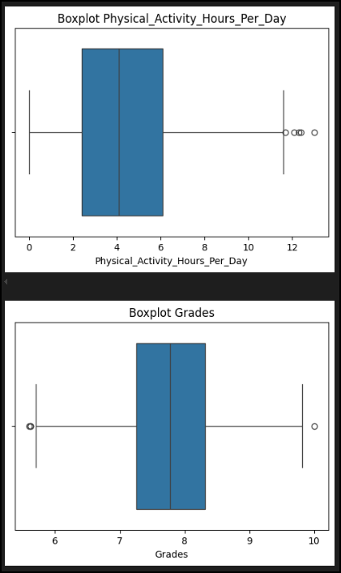
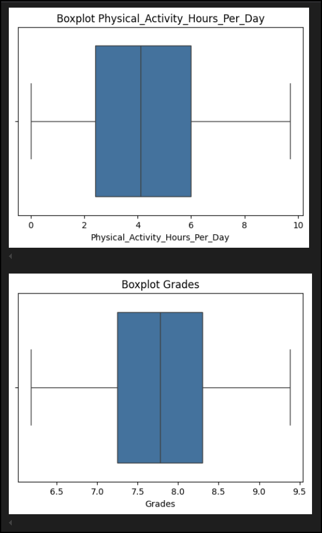
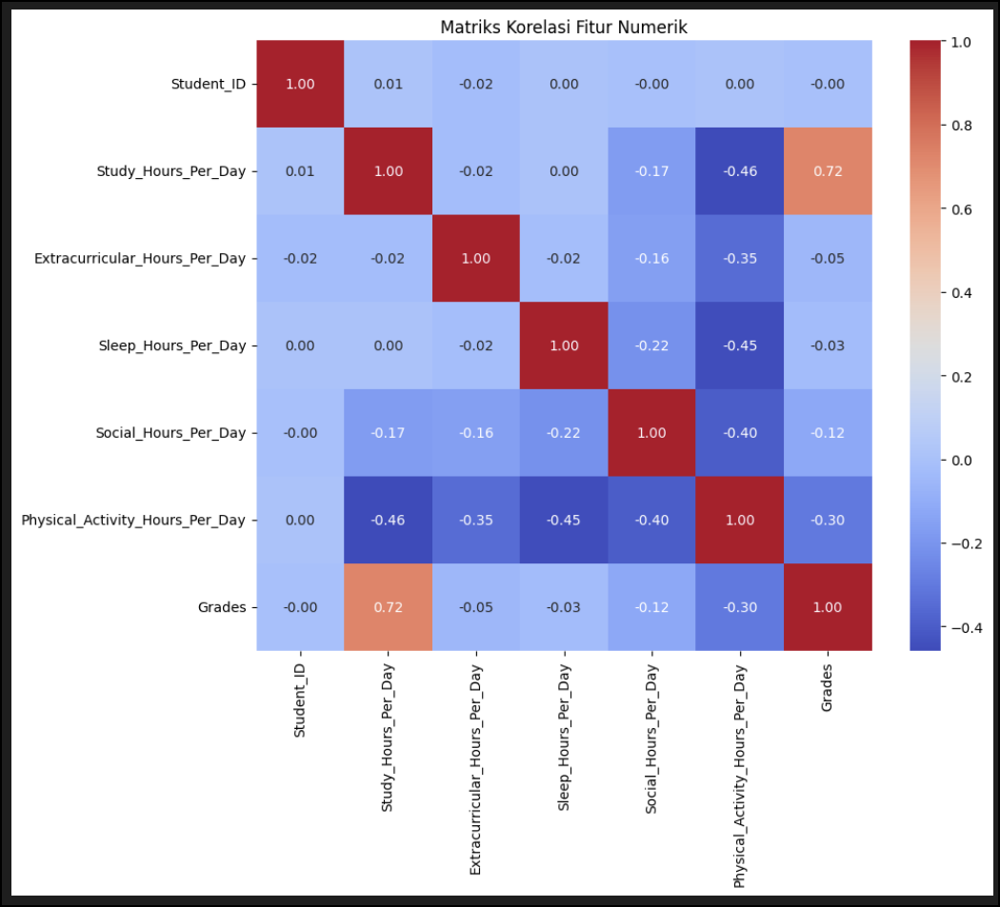

# Laporan Proyek Machine Learning - Prediksi Prestasi Akademik Mahasiswa

**Nama:** Muhammad Nur Alfin Huda 
**ID Dicoding:** m_nur_alfin_huda

## Domain Proyek
Prestasi akademik mahasiswa, yang dievaluasi dengan Indeks Prestasi Kumulatif (IPK), merupakan salah satu indikator keberhasilan dalam pendidikan tinggi.  Banyak faktor, di luar kecerdasan alamiah, yang dianggap mempengaruhi prestasi akademik.  Faktor-faktor tersebut antara lain kebiasaan belajar, manajemen waktu, kesehatan mental, dan aktivitas sosial/fisik.  Memahami bagaimana berbagai aspek gaya hidup ini mempengaruhi prestasi akademik dapat membantu individu meningkatkan strategi belajar mereka dan institusi pendidikan membangun program bantuan yang lebih efektif dan terfokus.  Dengan semakin banyaknya data yang tersedia dan terobosan dalam alat analisis data, pendekatan pembelajaran mesin dapat digunakan untuk memodelkan hubungan yang rumit ini dan membuat prediksi yang bermakna.

Masalah ini penting untuk diselesaikan karena dapat membantu mengurangi angka *drop-out*, meningkatkan kualitas lulusan, dan memberikan panduan praktis bagi mahasiswa dalam menyeimbangkan kehidupan akademik dan non-akademik. Penyelesaian masalah ini dapat mengarah pada pengembangan sistem rekomendasi personal bagi mahasiswa atau intervensi dini bagi mereka yang berisiko mengalami penurunan prestasi.

* **Berdasarkan hasil riset yang dilakukan terkait atau referensi:**
    * Menurut penelitian oleh Nonis & Hudson (2010), strategi manajemen waktu dan usaha belajar memiliki korelasi positif dengan IPK mahasiswa.
    * Studi oleh Damayanti (2024) menunjukkan bahwa Faktor gaya hidup seperti pola makan, aktivitas fisik dan penggunaan teknologi, serta peran keluarga dan lingkungan, mempunyai pengaruh yang signifikan terhadap kualitas hidup generasi muda. 

    * **Referensi:**
        1.  S. A. Nonis and G. I. Hudson, "Performance of college students: Impact of study time and study habits," *Journal of Education for Business*, vol. 85, no. 4, pp. 229-238, 2010.
        2.  N.Damayanti, "Analisis Faktor – Faktor Pengaruh Gaya dan Kuliatas Hidup Remaja" *JIMU: Jurnal Ilmiah Multi Disiplin*, Vol. 02, No. 01, Tahun 2024, Hal. 123 – 131, ISSN: 3031-9498 (Online),

## Business Understanding

### Problem Statements
Berdasarkan latar belakang di atas, beberapa masalah yang ingin dijawab dalam proyek ini adalah:
1.  Faktor gaya hidup manakah (seperti jam belajar, jam tidur, tingkat stres, dll.) yang memiliki pengaruh paling signifikan terhadap `Nilai` (nilai akademik) mahasiswa?
2.  Bagaimana hubungan antara masing-masing faktor gaya hidup tersebut dengan `Nilai` mahasiswa (apakah positif, negatif, atau tidak signifikan)?
3.  Apakah mungkin membangun model *machine learning* yang akurat untuk memprediksi `Nilai` mahasiswa berdasarkan kombinasi dari berbagai faktor gaya hidup mereka?
4.  Di antara beberapa algoritma regresi yang umum digunakan, model manakah yang memberikan performa prediksi terbaik?

### Goals
Tujuan dari proyek ini adalah untuk:
1.  Mengidentifikasi dan menganalisis faktor-faktor gaya hidup yang paling berpengaruh terhadap `Nilai` mahasiswa.
2.  Memvisualisasikan dan menginterpretasikan pola hubungan antara variabel-variabel gaya hidup dan `Nilai`.
3.  Mengembangkan dan melatih beberapa model regresi *machine learning* untuk memprediksi `Nilai` mahasiswa.
4.  Mengevaluasi dan membandingkan performa model-model tersebut menggunakan metrik evaluasi yang sesuai (MAE, RMSE, R²) untuk menentukan model terbaik sebagai solusi prediksi.

* **Solution Statement:** Untuk mencapai tujuan-tujuan tersebut, solusi yang diusulkan adalah dengan menerapkan alur kerja proyek *machine learning* yang komprehensif. Ini dimulai dari pengumpulan dan pemahaman data, dilanjutkan dengan pra-pemrosesan data dengan cermat (termasuk penanganan *outlier* dan *encoding* variabel kategorikal), kemudian melakukan pemodelan dengan beberapa algoritma regresi yaitu (Random Forest, Gradient Boosting, Ridge). Performa setiap model akan dievaluasi menggunakan metrik standar seperti MAE, RMSE, dan R². Model dengan performa terbaik akan dioptimalkan lebih lanjut melalui *hyperparameter tuning*. Akhirnya, hasil analisis dan model terbaik akan digunakan untuk menjawab pernyataan masalah dan memberikan rekomendasi.

## Data Understanding

Pada tahap ini, dilakukan eksplorasi awal untuk memahami karakteristik dataset yang digunakan. Dataset "Student Lifestyle and Academic Performance" diperoleh dari Kaggle dan berisi informasi mengenai berbagai aspek gaya hidup mahasiswa beserta nilai akademik mereka.
link dataset: https://www.kaggle.com/datasets/charlottebennett1234/lifestyle-factors-and-their-impact-on-students/data

* **Pemuatan Data dan Informasi Dasar:**
    Dataset dimuat menggunakan pustaka `pandas`.
    Berdasarkan output `df.info()`, dataset terdiri dari 2000 baris dan 9 kolom. Tidak terdapat nilai yang hilang (*missing values*) pada semua kolom. Tipe data bervariasi antara `int64`, `float64`, dan `object`.

* **Deskripsi Variabel:**
    Variabel-variabel yang terdapat dalam dataset adalah sebagai berikut:
    | Nama Variabel (Kolom)         | Tipe Data | Deskripsi Singkat                                    |
    | :---------------------------- | :-------- | :--------------------------------------------------- |
    | `Student ID`                  | `int64`   | Identifier unik mahasiswa                            |
    | `Study Hours_Per_Day`         | `float64` | Jam belajar per hari                                 |
    | `Extracurricular Hours_Per_Day` | `float64` | Jam kegiatan ekstrakurikuler per hari                |
    | `Sleep Hours_Per_Day`         | `float64` | Jam tidur per hari                                   |
    | `Social Hours_Per_Day`        | `float64` | Jam bersosialisasi per hari                          |
    | `Physical Activity_Hours_Per_Day` | `float64` | Jam aktivitas fisik per hari                       |
    | `Stress Level`                | `object`  | Tingkat stres (Low, Moderate, High)                |
    | `Gender`                      | `object`  | Jenis kelamin (Male, Female)                         |
    | `Grades`                      | `float64` | Nilai/IPK mahasiswa (Variabel Target)                |

    Nilai unik untuk kolom kategorikal (dari **Cell [4]**):
    * `Stress Level`: `['Moderate', 'Low', 'High']`
    * `Gender`: `['Male', 'Female']`

* **Statistik Deskriptif:**
    Statistik deskriptif untuk variabel numerik (**Cell [6]**):
    ```python
    # Output dari df.describe()
    Dari statistik deskriptif, kita dapat melihat rentang nilai, rata-rata, dan standar deviasi untuk setiap fitur numerik. Misalnya, rata-rata `Grades` adalah sekitar 7.49.
    ```
    
* **Analisis Outlier (Identifikasi Awal):**
    * Sebelum dilakukan penanganan outlier, visualisasi menggunakan boxplot dapat membantu mengidentifikasi keberadaan outlier pada fitur-fitur numerik.
        *Visualisasi boxplot pada notebook **Cell [9]** yang langsung melakukan deteksi.*
        

    Berdasarkan analisis menggunakan metode IQR (Interquartile Range) seperti yang dilakukan pada **Cell [9]** notebook, teridentifikasi adanya outlier pada fitur numerik `Physical_Activity_Hours_Per_Day`, `Grades`.

* **Penanganan Outlier:**
    Outlier dapat memengaruhi performa model regresi. Dalam proyek ini, outlier ditangani dengan metode IQR (Interquartile Range). Data poin yang berada di luar 1.5 * IQR di atas kuartil ketiga (Q3) atau di bawah kuartil pertama (Q1) dianggap sebagai outlier dan dihapus dari dataset.
    pada notebook cell [10]
    *Alasan:* Penghapusan outlier dengan metode IQR dilakukan untuk mengurangi distorsi pada model yang mungkin disebabkan oleh nilai-nilai ekstrem, dengan asumsi bahwa outlier tersebut mungkin merupakan anomali atau kesalahan pengukuran. Ini membantu dalam membangun model yang lebih general dan stabil.

* **Visualisasi Data (Setelah Penanganan Outlier Awal):**
    * **Distribusi Fitur Numerik:** Histogram dan Boxplot (dari **Cell [11]**) untuk setiap fitur numerik setelah penanganan outlier menunjukkan distribusi data yang lebih terkonsentrasi.
    *Visualisasi boxplot setelah penanganan outlier*
        
        
        Deskripsi: Histogram untuk 'Study Hours_Per_Day' menunjukkan distribusi yang sedikit miring ke kanan, dengan sebagian besar mahasiswa belajar antara X dan Y jam per hari. Boxplot untuk 'Grades' setelah penghapusan outlier menunjukkan median di sekitar Z dan sebaran data yang lebih rapat.
        
    * **Korelasi Antar Fitur Numerik:** Heatmap korelasi (dari **Cell [19]**) digunakan untuk melihat hubungan linear antar variabel.
    *Visualisasi heatmap, korelasi antar fitur numerik*
        

        Deskripsi: Terlihat korelasi positif yang cukup kuat antara 'Study Hours_Per_Day' dan 'Grades' (nilai korelasi 0.72), mengindikasikan bahwa semakin lama jam belajar, cenderung semakin tinggi nilai mahasiswa. Terdapat juga korelasi negatif selain 'Study Hours_Per_Day' dengan 'Grades'.
        

*  **Menghapus Fitur yang Tidak Relevan:**
    Kolom `Student ID` dihapus karena merupakan identifier unik dan tidak memiliki nilai prediktif.
    ```python
    # Dari Cell [21]
    df_cleaned = df.drop(columns=['Student ID'])
    ```

* **Insight yang menarik dari data.**
    * *Insight 1:* Durasi belajar per hari adalah prediktor positif yang kuat untuk nilai akademik.
    * *Insight 2:* Tingkat stres yang lebih tinggi cenderung berkorelasi dengan nilai akademik yang lebih rendah.

## Data Preparation

Tahap persiapan data krusial untuk memastikan data siap digunakan untuk pemodelan dan menghasilkan model yang optimal.

1.  **Encoding Variabel Kategorikal:**
    Model *machine learning* memerlukan input numerik. Oleh karena itu, variabel kategorikal perlu diubah.
    * **`Stress Level` (Ordinal Encoding):** Karena `Stress Level` memiliki tingkatan (Low < Moderate < High), `OrdinalEncoder` digunakan.
    * **`Gender` (Label Encoder):** `Gender` adalah variabel nominal.
    * Pada proses encoding untuk kolom asli `Gender` dan `Stress Level` dihapus dan digantikan dengan kolom baru hasil dari encoding `Gender_Encoded` dan `Stress_Level_Encoded`
        ```python
        # Notebook Cell [24]
        ```
    * Hasil Encoding pada Variabel Kategorikal
        * Mengubah gender menjadi 0 dan 1
            - 0 = Famale
            - 1 = Male
    
        * Mengubah level stres menjadi 0 1 2
            - 0 = Low
            - 1 = Moderate
            - 2 = High
2.  **Pembagian Data (Train-Test Split):**
    Dataset dibagi menjadi data latih (80%) dan data uji (20%) menggunakan library sklearn.model_selection mengimport train_test_split. fungsi dari pembagian data yaitu untuk melatih dan mengevaluasi model secara objektif.
    ```python
    # Dari Notebook Cell [26]
    ```
    `random_state=42` digunakan untuk memastikan hasil pembagian data konsisten dan dapat direproduksi.
    
    * Menampilkan hasil dari pembaigan data: 
        - Training set shape: 
            - X_train = (1534, 7)
            - y_train = (1534,)
        - Test set shape    : 
            - X_test  = (384, 7)
            - y_test  = (384,)
            
3.  **Feature Scaling (Penskalaan Fitur):**
    Penskalaan fitur dilakukan untuk menyamakan rentang nilai antar fitur numerik, yang penting untuk beberapa algoritma. `StandardScaler` digunakan untuk mentransformasi data sehingga memiliki mean 0 dan standar deviasi 1.
    ```python
    # Dari Notebook Cell [28]
    ```
    Penskalaan dilakukan *setelah* pembagian data untuk mencegah *data leakage* dari data uji ke data latih.

* **Dampak yang terjadi dari setiap langkah persiapan data.**
    * Dampak penghapusan outlier: Mengurangi varians dan potensi bias pada model, namun juga mengurangi jumlah data. Perlu diperhatikan apakah outlier yang dihapus benar-benar anomali.
    * Dampak encoding: Mengubah data kategorikal menjadi format numerik yang dapat diproses model, dengan tetap mempertahankan informasi (ordinalitas untuk Stress Level, representasi biner untuk Gender).
    * Dampak scaling: Membantu algoritma yang sensitif terhadap skala fitur (misalnya KNN) untuk konvergen lebih cepat dan memberikan bobot yang adil antar fitur.

## Modeling

Pada tahap ini, beberapa model regresi *machine learning* dilatih dan dievaluasi untuk menemukan model terbaik dalam memprediksi `Grades` mahasiswa.

1.  **Pemilihan Model Kandidat:**
    Model-model regresi berikut dipilih sebagai kandidat:
    * **Random Forest Regressor:** Model *ensemble* berbasis pohon keputusan, robas terhadap *overfitting*.
    * **KNeighbors Regressor:** Model non-parametrik berbasis kedekatan jarak.
    * **Gradient Boosting Regressor:** Model *ensemble* yang membangun model secara sekuensial dan iteratif.


2.  **Pelatihan Model Awal:**
    Semua model kandidat dilatih menggunakan data latih yang telah diproses (`X_train_scaled`, `y_train`) dengan parameter default mereka.
    ```python
    # Model yang akan digunakan:
    models = {
        "KNN" : KNeighborsRegressor(n_neighbors=15),
        "Random Forest": RandomForestRegressor(random_state=42),
        "Gradient Boosting": GradientBoostingRegressor(random_state=42),
    }
    ```
    - Model KNN : menggunakan parameter n_neighbors = 15, dimana fungsi parameter ini untuk menentukan jumlah tetangga terdekat (K) yang akan dipertimbangkan dalam memprediksi nilai titik data baru. Nilai 15 kemungkinan besar memberikan kinerja terbaik atau paling stabil pada dataset tersebut.
    - Model Random Forest : Menggunakan parameter random_state = 42, untuk mengontrol random number generator yang digunakan, sehingga dapat memastikan bahwa hasil pembagian dataset konsisten dan memberikan data yang sama setiap kali model dijalankan.
    - Model Gradient Boosting : sama seperti model sebelumnya menggunakan parameter random_state = 42.
     Performa awal dievaluasi pada data uji (`X_test_scaled`, `y_test`).
    ```python
    # Mengevaluasi performa model menggunakan matrik RMSE, R2, MAE
    ```
     
## Evaluation

Evaluasi model bertujuan untuk mengukur seberapa baik model yang telah dilatih dapat memprediksi `Grades` pada data yang belum pernah dilihat sebelumnya.

1.  **Metrik Evaluasi:**
    Metrik yang digunakan untuk mengevaluasi performa model regresi adalah:
    * **MAE (Mean Absolute Error):** `MAE = (1/n) * Σ|yi - ŷi|`. Mengukur rata-rata selisih absolut antara nilai aktual dan prediksi. Semakin kecil nilainya, semakin baik.
    * **RMSE (Root Mean Squared Error):** `RMSE = √MSE`. Akar kuadrat dari MSE, sehingga satuannya sama dengan variabel target. Lebih mudah diinterpretasikan daripada MSE. Semakin kecil nilainya, semakin baik.
    * **R² Score (Koefisien Determinasi):** `R² = 1 - (SSres / SStot)`. Mengukur proporsi varians dalam variabel target yang dapat dijelaskan oleh model. Nilainya berkisar antara 0 dan 1 (atau bisa negatif untuk model yang sangat buruk). Semakin mendekati 1, semakin baik modelnya.

2.  **Hasil Evaluasi Model:**
    * **Perbandingan Model Awal:**
        ```python
        Perbandingan Performa Model Awal (diurutkan berdasarkan R2):
                               RMSE        R2       MAE
        Gradient Boosting  0.492585  0.498441  0.394165
        Random Forest      0.510603  0.461078  0.411687
        KNN                0.513809  0.454289  0.424458
        ```
        Berdasarkan tabel perbandingan, Gradient Boosting merupakan model dengan R² tertinggi dan RMSE terendah sebelum tuning, kemudian melakukan tuning pada model dengan R² tertinggi dan RMSE terendah untuk meningkatkan performa model.

3.  **Hyperparameter Tuning (Improvement Model):**
    Berdasarkan performa awal, `GradientBoostingRegressor` menunjukkan hasil yang menjanjikan dan dipilih untuk optimasi lebih lanjut melalui *hyperparameter tuning*. `GridSearchCV` digunakan untuk mencari kombinasi hyperparameter terbaik secara sistematis.
    * Parameter yang di-*tune* untuk Gradient Boosting Regressor: `learning_rate`, `max_depth`, `min_samples_split`, `min_samples_leaf`, `n_estimators`.
    ```python
    # Cuplikan dari Notebook Cell [34]
    # Hyperparameter Tuning
    param_grid_gb = {
        'n_estimators': [100, 300],
        'learning_rate': [0.01, 0.1, 0.2],
        'max_depth': [3, 5, 10],
        'min_samples_split': [2, 5],
        'min_samples_leaf': [2, 4]
    }
    ```
    Penjelasan parameter : 
    * n_estimators: Jumlah pohon peningkat (boosting trees) yang akan dibangun.
        - 100: Akan mencoba 100 pohon.
        - 300: Akan mencoba 300 pohon.
    * learning_rate: Kontribusi setiap pohon terhadap hasil akhir.
        - 0.01: Tingkat pembelajaran yang sangat kecil.
        - 0.1: Tingkat pembelajaran standar.
        - 0.2: Tingkat pembelajaran yang sedikit lebih tinggi.
    * max_depth: Kedalaman maksimum setiap pohon individu dalam ensemble.
        - 3: Pohon dangkal, cenderung mencegah overfitting.
        - 5: Kedalaman menengah.
        - 10: Pohon lebih dalam, dapat menangkap pola kompleks tetapi berisiko overfitting.
    * min_samples_split: Jumlah minimum sampel yang diperlukan untuk membagi sebuah node internal.
        - 2: Minimal 2 sampel untuk membagi.
        - 5: Minimal 5 sampel untuk membagi.
    * min_samples_leaf: Jumlah minimum sampel yang diperlukan untuk menjadi node daun.
        - 2: Minimal 2 sampel di daun.
        - 4: Minimal 4 sampel di daun.
        
- Grid Search akan mencoba semua kombinasi yang mungkin dari nilai-nilai hyperparameter ini.
    Parameter terbaik yang ditemukan untuk Gradient Boosting adalah: (output yang dihasilkan: 
    `Best Parameters for Gradient Boosting: {'learning_rate': 0.01, 'max_depth': 3, 'min_samples_leaf': 4, 'min_samples_split': 2, 'n_estimators': 300}`
    Penjelasan parameter:
    -  learning_rate : 0.01 = menentukan seberapa besar kontribusi setiap pohon individu terhadap hasil akhir model, nilai 0.01 menunjukkan bahwa model GradientBoostingRegressor akan mendapatkan kinerja terbaik ketika setiap pohon (estimator) hanya membuat koreksi yang sangat kecil terhadap prediksi ensemble secara keseluruhan.
    -  max_depth : 3 =  Kedalaman maksimum dari setiap pohon keputusan individu yang dibangun, nilai 3 akan menggunakan pohon-pohon yang relatif dangkal dan sederhana.
    -  min_samples_leaf : 4 = Jumlah minimum sampel yang harus ada di node daun (leaf node) setelah pemisahan, setiap node daun pada setiap pohon harus memiliki setidaknya 4 sampel data. Hal ini berfungsi sebagai mekanisme regularisasi untuk mencegah overfitting.
    -  min_samples_split : 2 = Jumlah minimum sampel yang diperlukan untuk membagi sebuah node internal, dengan nilai 2 memungkinkan pemisahan dasar pada node.
    -  n_estimators : 300 = Jumlah total pohon keputusan individual yang dibangun secara berurutan, model akan membangun 300 pohon, di mana setiap pohon baru akan mencoba memperbaiki kesalahan prediksi yang dibuat oleh ensemble dari pohon-pohon sebelumnya.

    Model Gradient Boosting kemudian dilatih ulang menggunakan parameter terbaik ini.

    * **Evaluasi Model Terbaik Setelah Hyperparameter Tuning:**
        Model `Gradient Boosting` setelah di-*tune* dengan `GridSearchCV` dievaluasi pada data uji:
        ```python
        # Evaluasi model after tuning
        ```
        Hasilnya: 
        ```python
        Perbandingan Performa Model Setelah Tuning (diurutkan berdasarkan R2):
                                       RMSE        R2       MAE
        Gradient Boosting (Tuned)  0.484761  0.514249  0.389757
        Gradient Boosting          0.492585  0.498441  0.394165
        Random Forest              0.510603  0.461078  0.411687
        KNN                        0.513809  0.454289  0.424458
        ```
        Hasil evaluasi model setelah dilakukan tuning ulang, dapat dilihat pada hasil di atas yaitu Gradient Boosting (Tuned).
4.  **Analisis Hasil dan Pemilihan Model Terbaik:**
    *   Setelah dilakukan hyperparameter tuning model dengan hasil parameter terbaik, Gradient Boosting mengalami kenaikan hal tersebut menunjukkan bahwa hyperparameter tuning penting jika ingin meningkatkan kinerja model 
    * **Model Terbaik:** Berdasarkan metrik evaluasi, `GradientBoostingRegressor` yang telah dioptimalkan melalui *hyperparameter tuning* dipilih sebagai model terbaik.
        * **Alasan:** Model ini memberikan nilai R² tertinggi yaitu 0.514249 dan RMSE terendah yaitu 0.484761 pada data uji, menunjukkan kemampuan generalisasi dan akurasi prediksi yang paling baik di antara model-model yang diuji.

## Kesimpulan

Proyek ini bertujuan untuk menganalisis pengaruh faktor gaya hidup terhadap nilai akademik (`Grades`) mahasiswa dan membangun model prediktif menggunakan pendekatan *machine learning*.

1.  **Ringkasan Hasil Utama:**
    * Analisis data eksploratif dan penanganan *outlier* telah dilakukan untuk menyiapkan data yang berkualitas.
    * Beberapa model regresi (Random Forest, KNN, Gradient Boosting) telah dilatih dan dievaluasi.
    * Model `GradientBoostingRegressor` setelah melalui proses *hyperparameter tuning* menggunakan `GridSearchCV` menunjukkan performa terbaik dengan nilai R² sebesar 0.514249 dan RMSE sebesar 0.484761 pada data uji.
    * Berdasarkan analisis *feature importance* dari model Gradient Boosting terbaik, faktor-faktor utama yang paling signifikan memengaruhi `Grades` mahasiswa adalah `Study Hours_Per_Day` dan `Stress Level_encoded`.

2.  **Rekomendasi dan Saran:**
    * **Untuk Mahasiswa:** Hasil ini menggarisbawahi pentingnya alokasi waktu belajar yang cukup dan manajemen stres yang efektif dalam mencapai prestasi akademik yang optimal.
    * **Untuk Institusi Pendidikan:** Temuan ini dapat menjadi dasar untuk mengembangkan program dukungan mahasiswa yang lebih terfokus, misalnya, dengan menyediakan workshop manajemen waktu atau layanan konseling stres.
    * **Untuk Penelitian Selanjutnya:**
        * Eksplorasi teknik *feature engineering* yang lebih lanjut untuk mungkin menemukan interaksi fitur yang lebih kompleks.
        * Pengumpulan data dengan variabel yang lebih beragam (misalnya, latar belakang sosio-ekonomi, metode belajar spesifik).
        * Melakukan analisis error yang lebih mendalam pada model terbaik untuk memahami kasus-kasus di mana model gagal melakukan prediksi dengan baik.
        * Mencoba arsitektur model yang lebih canggih jika diperlukan, meskipun Gradient Boosting sudah memberikan hasil yang baik untuk dataset ini.
